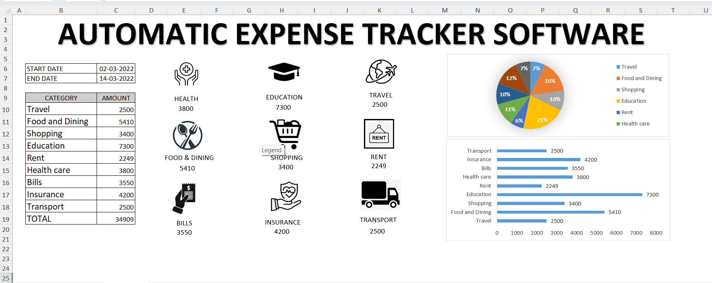

# Automatic Expense Tracker Dashboard (Excel)

## Overview
An interactive expense tracking dashboard built using Microsoft Excel to monitor and analyse personal expenses across multiple spending categories.

## Features
- Automatic expense tracking
- Category-wise expense analysis
- Interactive dashboard
- KPI reporting
- Pie chart and bar chart visualizations
- Date-wise expense monitoring

## Tools Used
- Microsoft Excel
- Pivot Tables
- Pivot Charts
- Slicers
- Conditional Formatting

## Dashboard Preview

